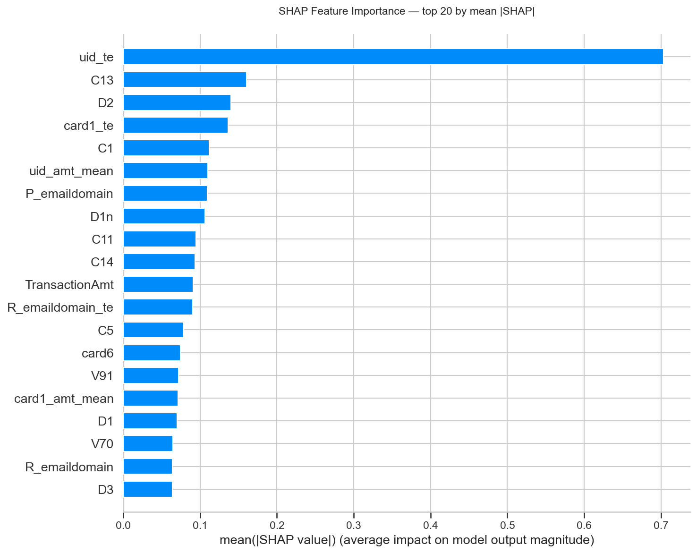

# IEEE-CIS Fraud Detection

[](https://github.com/Iva-q/ieee-fraud-detection/actions/workflows/ci.yml)
[](https://www.python.org/)
[](LICENSE)
[](https://github.com/astral-sh/ruff)

End-to-end ML service for detecting fraudulent credit card transactions on the
[Kaggle IEEE-CIS Fraud Detection](https://www.kaggle.com/competitions/ieee-fraud-detection)
dataset (590K training transactions, 434 features). Pet project built as a
study of modern ML engineering practices: reproducible feature engineering,
time-aware cross-validation, hyperparameter tuning, model interpretability,
and a production-style FastAPI service packaged in Docker.

**Result:** Private leaderboard 0.9275 AUC (rank 1085 / 6351, **top 17%**)
with a single LightGBM model. Deployed as a FastAPI service in a Docker container with p50 latency of 66 ms per transaction.


## Highlights

| Metric | Value |
|---|---|
| **Private leaderboard AUC** | **0.9275** |
| **Rank** | 1085 / 6351 (top 17%) |
| CV AUC (4-fold, expanding window) | 0.9336 ± 0.024 |
| Model | LightGBM with Optuna-tuned hyperparameters |
| Features after selection | 261 (of 471 engineered) |
| Inference latency (p50 / p95, Docker) | 66 ms / 84 ms |
| Model size on disk | 11.5 MB (booster) + 35 MB (preprocessor lookups) |

**Key engineering decisions that mattered:**

- **UID reconstruction** (`card1 + addr1 + D1n`): the single highest-leverage
  feature engineering step. Adding UID-based aggregations and OOF target
  encoding moved the model from CV 0.909 to 0.929 (+0.020 AUC, the
  breakthrough iteration).
- **Time-aware cross-validation with expanding windows**: avoids leaking future
  into past. Revealed a stable CV/LB divergence for target encoding (explained
  in `reports/experiments.md`).
- **Inference-time preprocessor** (`src/inference/preprocessor.py`): reproduces
  the full feature-engineering pipeline for a single transaction by replaying
  lookup tables saved at training time. Verified bit-exact equality with the
  training-time pipeline on 5 random test rows.
- **Production-style service**: FastAPI + Pydantic-validated schemas + Docker
  container with non-root user, healthcheck, and resource limits.


## How the model sees fraud



The top feature — `uid_te` (OOF target encoding on the reconstructed client
UID) — has 4.5x the importance of the next strongest feature. Most of the
predictive signal comes from **combining the anonymized Vesta features
(C1–C14, D1–D15, V-columns) with engineered client-level aggregations**.

See `reports/figures/` for the full SHAP analysis including beeswarm,
dependence plots, and individual force plots for one true positive and one
false positive.

## Project structure
```
ieee-fraud-detection/
├── src/
│   ├── data/split.py            # Time-based CV (expanding-window splits)
│   ├── features/                # Feature engineering modules
│   │   ├── time_features.py     # hour, day-of-week, is_night
│   │   ├── money_features.py    # log_amt, has_cents
│   │   ├── aggregations.py      # per-card1 amount stats
│   │   ├── encodings.py         # frequency + OOF target encoding
│   │   ├── uid_features.py      # UID reconstruction (card1+addr1+D1n)
│   │   └── build_features.py    # orchestrator for the whole FE pipeline
│   └── inference/
│       └── preprocessor.py      # Inference-time FE via saved lookup tables
│
├── app/                         # FastAPI service
│   ├── main.py                  # /health, /predict endpoints
│   ├── schemas.py               # Pydantic v2 request/response models
│   └── model_registry.py        # Singleton model loader (test-injectable)
│
├── notebooks/                   # Exploration and experiments (9 notebooks)
│   ├── 00_load_and_inspect.ipynb
│   ├── 01_eda_basics.ipynb
│   ├── 02_baseline.ipynb          →  v0: LGBM baseline
│   ├── 03_baseline_with_fe.ipynb  →  v1: + time/money/card1 aggs
│   ├── 04_encodings.ipynb         →  v2: + frequency + OOF target enc
│   ├── 05_uid.ipynb               →  v3: + UID reconstruction  [breakthrough]
│   ├── 06_feature_selection.ipynb →  v4: permutation-based selection
│   ├── 07_optuna.ipynb            →  v5: Optuna tuning (final model)
│   ├── 08_catboost.ipynb          →  CatBoost + blend (abandoned, documented)
│   └── 09_shap.ipynb              →  SHAP interpretability
│
├── tests/                       # 24 pytest tests (all run in CI)
│   ├── conftest.py
│   ├── test_preprocessor.py     # 12 unit tests for FraudPreprocessor
│   └── test_api.py              # 12 integration tests for FastAPI
│
├── reports/
│   ├── experiments.md           # Full log of 5 model iterations + SHAP
│   ├── ideas.md                 # Notes from top Kaggle solutions
│   ├── selected_features_v4.json
│   ├── best_params_v5.json      # Optuna-tuned LightGBM hyperparameters
│   └── figures/                 # 12 plots (EDA + feature importance + SHAP)
│
├── .github/workflows/ci.yml     # pytest on every push
├── Dockerfile                   # Python 3.11 slim, non-root user, healthcheck
├── docker-compose.yml           # docker compose up -> service on :8000
├── pyproject.toml               # Project dependencies and tooling
└── sample_transaction.json      # Demo payload for /predict
```


## How to run

### Option 1 — Docker (recommended)

```bash
docker compose up -d
```

Service is then available at `http://localhost:8000`:

- Swagger UI: http://localhost:8000/docs
- Health check: http://localhost:8000/health
- Prediction: `POST http://localhost:8000/predict` with a JSON body

To stop:

```bash
docker compose down
```

Note: model artifacts (`models/lgbm_v5.txt` and `models/preprocessor.pkl`)
are gitignored due to size (~46 MB combined). To build them, run
`notebooks/07_optuna.ipynb` end-to-end — the last cell saves both files.

### Option 2 — Local Python

```bash
# Install the project in editable mode with serving dependencies
pip install -e ".[serve]"

# Start the server
uvicorn app.main:app --host 0.0.0.0 --port 8000
```

### Option 3 — Quick demo via curl

```bash
# Assuming the service is running on :8000
curl -X POST http://localhost:8000/predict \
     -H "Content-Type: application/json" \
     -d @sample_transaction.json
```

Expected response:

```json
{
  "transaction_id": 3663549,
  "fraud_probability": 0.00020,
  "label": "not_fraud",
  "threshold": 0.5,
  "model_version": "lgbm_v5"
}
```

### Reproducing the model training

```bash
# Download Kaggle competition data to data/raw/
kaggle competitions download -c ieee-fraud-detection -p data/raw
# Then run notebooks 00 -> 07 in order; each saves its artifacts.
```

### Running tests

```bash
pytest tests/ -v
```

## Methodology

### Feature engineering

The feature engineering pipeline is modular: each module in `src/features/`
produces a specific family of features, and `build_features.py` orchestrates
the chain. All transformations are computed over **train + test combined**
to keep statistics stable (no leakage — target is only used in OOF target
encoding).

1. **Time features** (day, hour, dayofweek, is_night from `TransactionDT`)
2. **Money features** (log-amount, cents, amt_has_cents)
3. **Card1 aggregations** (per-card amount mean/std/max, nunique-product)
4. **UID reconstruction** — the core idea of this project:
   `UID = card1 + addr1 + (D1 - day)`.
   The last term (`D1n`) is invariant per client (days since card registration).
   This proxy is much sharper than `card1` alone: 199K unique UIDs over 524K
   transactions (~2.6 txns per UID, vs up to 28K per `card1`).
   See `src/features/uid_features.py`.
5. **Frequency encoding** on high-cardinality categoricals.
6. **Out-of-fold target encoding** with expanding-window folds and Bayesian
   smoothing. Fold 0 is filled with the global mean to prevent distribution
   shift between train and validation — an earlier self-bootstrap version
   caused AUC on fold 1 to drop to 0.82 (documented in `experiments.md`).

### Cross-validation

Time-based, expanding-window, 5 folds. Fold 0 is never used for validation;
each subsequent fold trains on all earlier data and validates on itself.
Rationale: fraud patterns drift over time, and the private leaderboard covers
a future period relative to training — a random shuffle KFold would overstate
performance by leaking future client behavior into past predictions.

### Model and tuning

Single LightGBM gradient-booster, tuned with **Optuna** (50 trials, TPE sampler
with MedianPruner). Final hyperparameters (saved in `reports/best_params_v5.json`):

- `num_leaves` 127 (up from default 63) — earlier versions were underfitting.
- `learning_rate` 0.011 — slow but accurate; compensated with more trees.
- `min_child_samples` 23 — captures rare UID patterns.
- `feature_fraction` 0.52 — per-tree randomization for diversity.
- `reg_alpha` 0.12, `reg_lambda` 0.02 — mild L1/L2.

### Model interpretability

Full SHAP analysis on fold-4 model (5000-row stratified sample). `uid_te`
dominates with mean |SHAP| = 0.70 (next feature: 0.16). The dependence plot
shows a three-regime S-curve (clean history → transition → near-certain fraud),
and the interaction with `TransactionAmt` reveals the model correctly flags
the **card-testing pattern** (low-amount transactions from historically
suspicious UIDs).

### What did NOT work

- **CatBoost + LightGBM ensemble**. Blend correlation was too high (Pearson
  0.96, Spearman 0.90) — adding CatBoost predictions with any non-zero weight
  hurt CV by up to -0.003 AUC. Ensemble was abandoned in favor of more useful
  engineering work. See `notebooks/08_catboost.ipynb`.
- **Feature selection by permutation importance** removed 45% of features
  (210 of 471) with net effect within noise (+0.0003 CV AUC, -0.0008 Private LB).
  Main benefit was training speedup (30% faster per fold), useful for Optuna.

## Experiments log

Each row is a separate commit + Kaggle submission with a corresponding OOF
file under `data/predictions/`. Detailed analysis in `reports/experiments.md`.

| Version | Changes | CV AUC | Public LB | Private LB |
|---|---|---|---|---|
| v0 | LightGBM baseline on raw features | 0.9074 | 0.9169 | 0.8955 |
| v1 | + time, money, card1 aggregations | 0.9094 | 0.9225 | 0.9024 |
| v2 | + frequency + OOF target encoding | 0.9087 | 0.9280 | 0.9068 |
| **v3** | **+ UID reconstruction**  | 0.9291 | 0.9502 | 0.9257 |
| v4 | + permutation-based feature selection | 0.9293 | 0.9504 | 0.9249 |
| v5 | + Optuna hyperparameter tuning | **0.9336** | **0.9523** | **0.9275** |

**Observations:**

- **CV/LB divergence before v3**: for versions v1 and v2, CV underestimated
  the LB gain by ~3x. This is a known artifact of expanding-window CV combined
  with target encoding — fold 0 is filled with a constant, so the model can't
  learn to use TE when training on fold 0 alone. On the real test set, trained
  on the full train, TE becomes useful. This divergence vanished from v3 onward.
- **UID reconstruction was the breakthrough**: single biggest jump in the
  project (+0.020 CV, +0.022 Public LB in one iteration).
- **Optuna gave honest +0.002–0.004 AUC** — exactly the range I expected
  before running it, and confirmed by the LB delta.

## What I'd improve next

This is a pet project with a 2-week time budget. Sharper production work
would require:

1. **Second model for true ensemble diversity.** CatBoost correlated too
   highly with the primary LightGBM (Pearson 0.96). A **neural network** on
   the same features would likely give orthogonal errors — small MLP or
   TabNet on top of our engineered features, then rank-average blend.
   Realistic gain: +0.003–0.005 AUC.
2. **UID-based post-processing** (the winning team's technique). For UIDs
   with multiple transactions, replace individual predictions with the
   client's average. This alone moved the first-place solution from
   Private 0.943 to 0.946. Would require careful handling for new/unseen
   UIDs in production.
3. **Online feature store** for the preprocessor lookups. Currently they're
   a static pickle — fine for demo, but any real service needs UID/card1
   aggregates that grow with every new transaction. Feast or a custom
   Redis layer would handle this.
4. **Monitoring**: Prometheus metrics exposure (request latency, prediction
   distribution by fold), model-drift alerts on SHAP value distributions.
5. **Calibration**: current probabilities are not probability-calibrated
   (gradient boosting tends to be over/underconfident). For production use,
   add an isotonic or Platt calibration layer so `fraud_probability` can
   actually drive cost-based thresholds.
6. **Docker image size**: currently 1.1 GB; multi-stage build + slim runtime
   should cut this to ~400 MB.

## References

- Chris Deotte's "XGB with Magic" — origin of the UID reconstruction idea:
  https://www.kaggle.com/competitions/ieee-fraud-detection/discussion/111510
- 1st place solution writeup:
  https://www.kaggle.com/competitions/ieee-fraud-detection/discussion/111284
- ODS.ai "Как правильно фармить Kaggle":
  https://habr.com/ru/companies/ods/articles/426227/

## License

MIT — see `LICENSE` file.